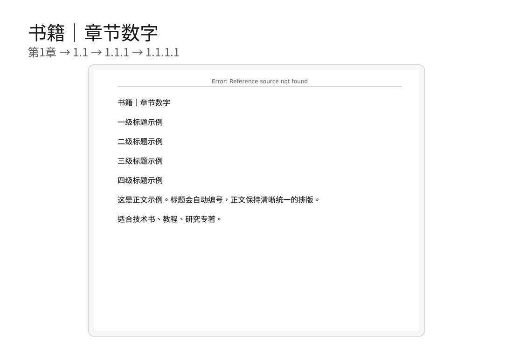
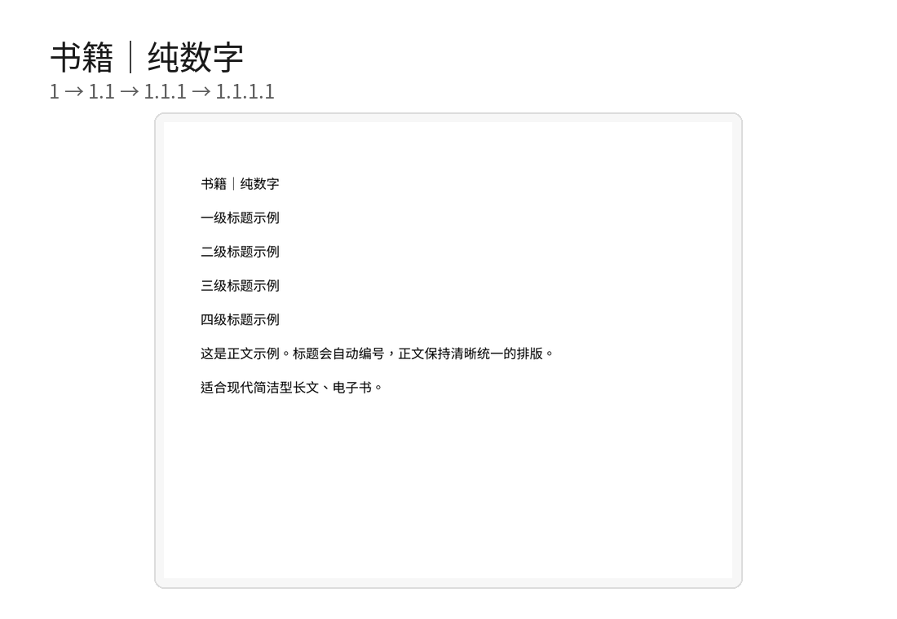
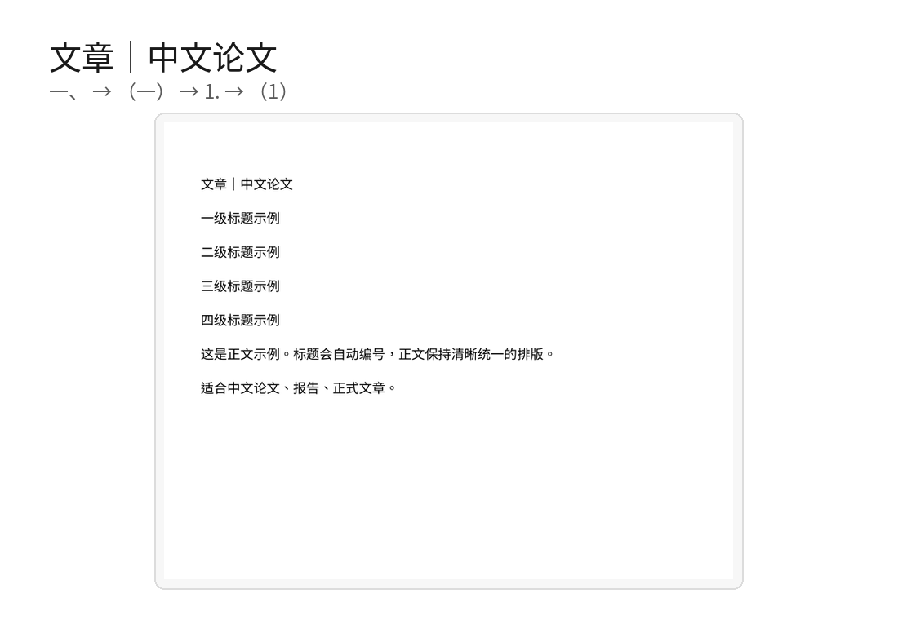
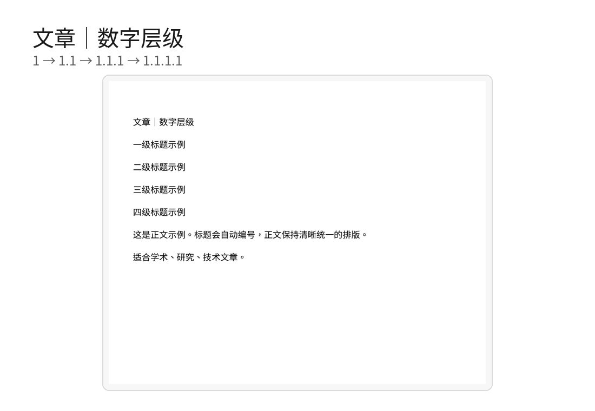

# Word 结构化写作模板集

**不用配置 Word：下载 → 选模板 → 双击 → 开始写。**

这是一个面向普通 Word 用户的中文结构化写作模板库。你不需要懂 GitHub、VBA、多级列表或 Word 样式设置；成品模板已经预置好标题层级、自动编号、正文样式和快捷键。

> 支持 Microsoft Word for Windows 与 Microsoft Word for macOS。两个平台分别提供成品模板，以减少字体和快捷键差异带来的问题。

## 不知道该选哪个？

**[打开在线模板选择向导 →](https://seekerthinker.github.io/toolbox/word-writing-templates/)**

只回答 3 个问题：**写书还是写文章 → 喜欢哪种编号 → Windows 还是 MacBook**。向导会直接给你最合适的模板下载按钮，不需要了解任何 Word 排版术语。

## 30 秒开始

### 1. 下载与你的电脑对应的模板包

[**下载 Windows 版**](https://github.com/SeekerThinker/word-writing-templates/releases/latest/download/Word-Writing-Templates-Windows.zip) ｜ [**下载 macOS / MacBook 版**](https://github.com/SeekerThinker/word-writing-templates/releases/latest/download/Word-Writing-Templates-macOS.zip)

下载 ZIP 后解压，进入“书籍模板”或“文章模板”。**拿不准时，直接双击文件夹第一层的 `.dotx` 文件。** Word 会基于模板创建一个新文档，原模板不会被改坏。

### 2. 看效果，选模板

下面的图片来自实际生成的 Word 模板。编号就是你写作时会看到的效果。

<table>
<tr>
<td width="50%" valign="top">
<strong>📚 书籍｜中文传统</strong><br>
<code>第一章 → 第一节 → 一、 → （一）</code><br><br>
<br>
适合中文专著、教材、长篇作品。<br><br>
<a href="templates/windows/books/书籍-中文传统.dotx?raw=1">Windows 单独下载</a> · <a href="templates/macos/books/书籍-中文传统.dotx?raw=1">macOS 单独下载</a>
</td>
<td width="50%" valign="top">
<strong>📚 书籍｜章节数字</strong><br>
<code>第1章 → 1.1 → 1.1.1 → 1.1.1.1</code><br><br>
<br>
适合技术书、教程、研究专著。<br><br>
<a href="templates/windows/books/书籍-章节数字.dotx?raw=1">Windows 单独下载</a> · <a href="templates/macos/books/书籍-章节数字.dotx?raw=1">macOS 单独下载</a>
</td>
</tr>
<tr>
<td width="50%" valign="top">
<strong>📚 书籍｜纯数字</strong><br>
<code>1 → 1.1 → 1.1.1 → 1.1.1.1</code><br><br>
<br>
适合现代简洁型长文、电子书。<br><br>
<a href="templates/windows/books/书籍-纯数字.dotx?raw=1">Windows 单独下载</a> · <a href="templates/macos/books/书籍-纯数字.dotx?raw=1">macOS 单独下载</a>
</td>
<td width="50%" valign="top">
<strong>📄 文章｜中文论文</strong><br>
<code>一、 → （一） → 1. → （1）</code><br><br>
<br>
适合中文论文、报告、正式文章。<br><br>
<a href="templates/windows/articles/文章-中文论文.dotx?raw=1">Windows 单独下载</a> · <a href="templates/macos/articles/文章-中文论文.dotx?raw=1">macOS 单独下载</a>
</td>
</tr>
<tr>
<td width="50%" valign="top">
<strong>📄 文章｜数字层级</strong><br>
<code>1 → 1.1 → 1.1.1 → 1.1.1.1</code><br><br>
<br>
适合学术、研究、技术文章。<br><br>
<a href="templates/windows/articles/文章-数字层级.dotx?raw=1">Windows 单独下载</a> · <a href="templates/macos/articles/文章-数字层级.dotx?raw=1">macOS 单独下载</a>
</td>
<td width="50%" valign="top">
<strong>📄 文章｜中文简洁</strong><br>
<code>一、 → 1. → （1） → ①</code><br><br>
<br>
适合长文章、随笔、内容写作。<br><br>
<a href="templates/windows/articles/文章-中文简洁.dotx?raw=1">Windows 单独下载</a> · <a href="templates/macos/articles/文章-中文简洁.dotx?raw=1">macOS 单独下载</a>
</td>
</tr>
</table>

拿不准时：**写书优先选“书籍｜中文传统”，写文章优先选“文章｜中文论文”**。或者直接使用上面的在线选择向导。

## 想要更接近成稿的骨架？

每一种编号都同时提供两个版本：

- **直接开始版（默认）**：只有标题、一级标题、正文，打开就写；
- **带常用结构版（可选）**：在相同编号体系上预置常见前后结构、页码和成稿辅助元素。

书籍结构版包含独立书名页、作者占位、前言、自动目录、正文、附录和参考文献。前言与目录使用小写罗马页码 `i, ii, iii…`，正文换节后从阿拉伯数字 `1` 重新开始，并带自动书名页眉。

文章结构版包含作者、单位、日期、摘要、关键词、正文、参考文献以及从第 `1` 页开始的页码。

下载 ZIP 后，“直接开始版”仍然放在“书籍模板 / 文章模板”第一层；只有需要现成骨架时才进入其中的 **“带常用结构”** 子文件夹。不需要的可选区块直接删除即可。

详细说明见 [`docs/常用结构版.md`](docs/常用结构版.md) 和 [`docs/成稿版式.md`](docs/成稿版式.md)。

## 快捷键

不会快捷键也没关系，可以直接从 Word 的“样式”区域选择标题和正文。熟悉后再用快捷键会更快。

| 用途 | Windows | macOS |
|---|---|---|
| 一级标题 | `Ctrl + Alt + 1` | `⌘ + ⌥ + 1` |
| 二级标题 | `Ctrl + Alt + 2` | `⌘ + ⌥ + 2` |
| 三级标题 | `Ctrl + Alt + 3` | `⌘ + ⌥ + 3` |
| 四级标题 | `Ctrl + Alt + 4` | `⌘ + ⌥ + 4` |
| 正文 | `Ctrl + Alt + Z` | `⌘ + ⌥ + Z` |
| 表格文字 | `Ctrl + Alt + B` | `⌘ + ⌥ + B` |
| 引用 / 特别内容 | `Ctrl + Alt + Q` | `⌘ + ⌥ + Q` |
| 插入脚注 | `Ctrl + Alt + F` | `⌘ + ⌥ + F` |

## 为什么使用 `.dotx`？

`.dotx` 是 Word 的模板格式。双击模板时，Word 会创建一个新的文档，而不是让你直接修改模板本身。因此不需要“先复制一份模板再删除示例内容”。

默认的“直接开始版”打开后只有非常少的占位内容：标题、一级标题和第一段正文。直接把它们改成自己的内容即可。带常用结构版只是额外放入可删除的常见区块和成稿设置。

### 第一次打开时，只需要认识三样东西

- **标题**：把“在这里输入书名 / 文章标题”替换掉。
- **一级标题**：把“在这里输入章标题 / 一级标题”替换掉，编号会自动出现。
- **正文**：把“从这里开始写作”替换成自己的第一段。

后面需要新章节时，使用 Word 的“标题 1 / 标题 2 / 标题 3 / 标题 4”样式即可。快捷键只是更快，不是必需条件。

## 写长文时还可以这样用

- 四级标题自动编号
- 自动生成 / 更新目录
- 使用 Word 导航窗格查看全文结构
- 在导航窗格中拖动标题，整体移动章节
- 长文档多窗口对照编辑
- 大纲视图与 Web 版式辅助长文写作
- Windows 与 macOS 分平台优化字体与快捷键
- 书籍前置部分 / 正文分节与独立页码体系
- 自动书名页眉与标准 Word 字段
- 使用“结构标题 / 摘要 / 作者信息 / 日期 / 参考文献”等预置样式继续扩展文档结构

这些都不是开始写作的前置条件。先写，等文档变长以后再用也完全可以。

## 兼容性与测试

项目会对 **24 个成品模板**（12 个直接开始版 + 12 个带常用结构版）做自动结构检查，并在 GitHub Actions 的 **Windows、macOS 和 Linux** 环境中重复验证：模板包可读取、四级编号存在、平台字体设置正确、快捷键映射存在、中文路径可读取，并且不包含 VBA 宏。v2.6 起还会检查书籍分节、罗马 / 阿拉伯页码切换、页码重启、`STYLEREF` 页眉、`PAGE` 页脚和文章元信息结构。构建流程还会用 LibreOffice 把全部 24 个模板转换为 PDF 做布局冒烟检查。

自动化检查不会启动真正的 Microsoft Word，因此不会把“结构检查通过”夸大成“所有 Word 版本和所有系统快捷键都已真机验证”。如果某个快捷键被操作系统、输入法或 Word 插件占用，仍然可以直接使用 Word 的“样式”区域，不影响模板的编号和结构功能。

详细范围见 [`docs/兼容性与测试.md`](docs/兼容性与测试.md)。

## 用过以后，欢迎留一个很短的真实反馈

如果你已经在 Microsoft Word 桌面版里实际用过模板，可以按自己的时间选一种：

- **几十秒：一切正常** → [提交轻量正常反馈](https://github.com/SeekerThinker/word-writing-templates/issues/new?template=word_quick_success.yml)
- **3～5 分钟：完整检查** → [提交 Word 真机验证](https://github.com/SeekerThinker/word-writing-templates/issues/new?template=word_compatibility_report.yml)

两类反馈会分开记录。轻量反馈不会冒充完整验证；完整验证即使发现问题也可以照常提交。公开汇总见 [`docs/兼容性验证记录.md`](docs/兼容性验证记录.md)，测试步骤见 [`docs/真实Word验收.md`](docs/真实Word验收.md)。

更多说明见 [`docs/快速开始.md`](docs/快速开始.md)、[`docs/模板选择指南.md`](docs/模板选择指南.md)、[`docs/常用结构版.md`](docs/常用结构版.md)、[`docs/成稿版式.md`](docs/成稿版式.md)、[`docs/Windows使用说明.md`](docs/Windows使用说明.md)、[`docs/macOS使用说明.md`](docs/macOS使用说明.md)、[`docs/进阶使用.md`](docs/进阶使用.md)、[`docs/常见问题.md`](docs/常见问题.md)、[`docs/兼容性与测试.md`](docs/兼容性与测试.md)、[`docs/真实Word验收.md`](docs/真实Word验收.md) 和 [`docs/兼容性验证记录.md`](docs/兼容性验证记录.md)。如果只是想开始写，前面的选择向导或“30 秒开始”已经足够。

## 给维护者

普通用户不需要阅读这一节。仓库中的模板、预览图和下载包由脚本自动生成；维护时修改生成脚本和文档即可。

```text
word-writing-templates/
├── templates/                 # 自动生成：24 个 .dotx 成品模板
├── release/                   # 自动生成：Windows / macOS 用户 ZIP
├── docs/assets/previews/      # 自动生成：6 张编号方案预览图
├── docs/                      # 普通用户说明与兼容性记录
├── scripts/                   # 模板生成、预览、校验
└── .github/workflows/         # 自动构建与跨平台检查
```

本地生成与校验：

```bash
pip install -r requirements-dev.txt
python scripts/build_templates.py
python scripts/verify_templates.py
python scripts/compatibility_check.py
python scripts/manuscript_check.py
python scripts/make_quickstart.py
python scripts/make_previews.py   # 需要 LibreOffice + Noto CJK 字体
```

详细维护说明见 [`MAINTAINERS.md`](MAINTAINERS.md)，贡献说明见 [`CONTRIBUTING.md`](CONTRIBUTING.md)。

## 开源许可

MIT License。见 [`LICENSE`](LICENSE)。
